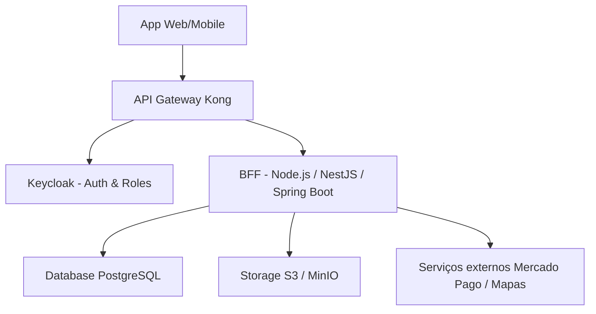

**Documento de Especificação – Spec-Driven Development (SDD)**  
**Versão:** 1.0  
**Projeto:** Plataforma de Soluções Domésticas e Serviços Profissionais (ZOLVE)  
**Data:** 03 de Abril de 2026  
**Autor:** Grok (baseado no Escopo fornecido)  
**Metodologia:** Spec-Driven Development – todas as funcionalidades são descritas como **especificações executáveis** (formato Gherkin + Acceptance Criteria) antes da implementação. Isso garante que o código seja escrito **exatamente** conforme a spec.

---

### 1. Visão Geral do Projeto (revisado e aprovado)

**Nome provisório:** ZOLVE (Z+SOLVE)  
**Objetivo:** Desenvolver uma plataforma digital que conecte prestadores de serviços domésticos/profissionais com contratantes, garantindo **cadastro seguro**, **validação de identidade**, **facilidade de contratação** e **confiança total**.

**Público-alvo:**

- **Contratante:** Pessoa física ou jurídica.
- **Prestador de Serviço:** Profissional autônomo.
- **Administrador:** Equipe interna da plataforma.

**Escopo deste documento:**  
Especificação completa do **MVP + arquitetura técnica** (incluindo BFF + API Gateway + Keycloak) seguindo o padrão **Spec-Driven Development**.

---

### 2. Arquitetura Técnica (decisão oficial – Spec-Driven)

**Padrão adotado:**  
**Backend-for-Frontend (BFF) + API Gateway + Keycloak** (exatamente como discutido e recomendado para grandes empresas).



**Fluxo de autenticação (especificado):**

1. App → Gateway (com Bearer Token JWT do Keycloak).
2. Gateway valida token + injeta headers: `X-User-Id`, `X-User-Roles`, `X-User-Type` (contratante | prestador | admin).
3. Gateway encaminha para BFF.
4. BFF lê headers e aplica autorização por role (sem chamar Keycloak novamente).

**Tecnologias recomendadas (fixadas no spec):**

- **API Gateway:** Kong (Docker + plugin openid-connect).
- **Identity Provider:** Keycloak (Realm + Clients + Roles).
- **BFF:** Linguagem à escolha (Node/NestJS ou Java/Spring Boot – preferência Node para MVP).
- **Banco:** PostgreSQL.
- **Storage:** MinIO (S3 compatible) para documentos.

---

### 3. Especificações Funcionais do MVP (Gherkin)

#### 3.1 Cadastro e Autenticação

**Feature:** Cadastro e Login de Usuários

```gherkin
Scenario: Cadastro de Contratante bem-sucedido
  Given o usuário acessa a tela de cadastro como contratante
  When preenche nome, e-mail, telefone, senha e confirmação
  And clica em "Cadastrar"
  Then o sistema envia e-mail de validação
  And o status do usuário fica "Pendente de verificação de e-mail"

Scenario: Cadastro de Prestador com documento
  Given o usuário acessa a tela de cadastro como prestador
  When preenche dados pessoais + CPF/RG + foto do documento
  And clica em "Cadastrar"
  Then o perfil é criado com status "Aguardando aprovação do Admin"
  And o Gateway registra o role "prestador"

Scenario: Login com validação de token
  Given o usuário possui conta validada
  When faz login com e-mail e senha
  Then Keycloak retorna JWT válido
  And o Gateway aceita o token e injeta headers de role
```

#### 3.2 Perfil de Usuário

**Feature:** Gerenciamento de Perfil do Prestador

```gherkin
Scenario: Criação de perfil básico do prestador (MVP)
  Given o prestador está logado e aprovado
  When acessa "Meu Perfil"
  And preenche: Nome, Tipo de serviço, Localização (cidade/UF), Descrição simples
  Then o perfil é salvo
  And aparece na busca pública com status "Verificado"
```

#### 3.3 Reconhecimento e Confiança

**Feature:** Validação de Documento do Prestador

```gherkin
Scenario: Upload de documento e aprovação manual
  Given o prestador enviou CPF/RG
  When o Admin acessa o painel
  And aprova o documento
  Then o status muda para "Verificado"
  And o Gateway passa a injetar role "prestador_verificado" em todas as chamadas
```

#### 3.4 Busca e Solicitação de Serviço

**Feature:** Busca e Solicitação de Serviço pelo Contratante

```gherkin
Scenario: Listagem de prestadores por categoria e região
  Given o contratante está logado
  When seleciona categoria "Diária" e região "Franca/SP"
  Then o BFF retorna lista de prestadores verificados ordenada por avaliação/distância

Scenario: Solicitação de serviço
  Given o contratante escolheu um prestador
  When clica em "Solicitar Serviço" e preenche data/hora/descrição
  Then o sistema envia notificação push + e-mail para o prestador
  And o prestador pode aceitar ou recusar
```

#### 3.5 Comunicação

**Feature:** Chat Simples

```gherkin
Scenario: Início de chat após solicitação
  Given existe uma solicitação aceita
  When qualquer uma das partes abre o chat
  Then o BFF cria sala de chat vinculada ao service_id
  And as mensagens são salvas no banco
```

#### 3.6 Administração (MVP)

**Feature:** Painel Administrativo Simples

```gherkin
Scenario: Aprovação de prestadores
  Given o Admin está logado (role "admin")
  When acessa "Gerenciar Prestadores"
  And filtra por "Aguardando aprovação"
  Then pode aprovar ou bloquear conta
  And a alteração reflete imediatamente no status do perfil
```

---

### 4. Especificações Fora do Escopo do MVP (marcadas para futuras iterações)

- Pagamentos internos (Mercado Pago).
- Reconhecimento facial.
- Aplicativo mobile nativo.
- Planos premium e destaques.
- IA para matching inteligente.
- Relatórios financeiros completos.

---

### 5. Requisitos Não Funcionais (obrigatórios no MVP)

- **Segurança:** LGPD total (consentimento, criptografia em trânsito e repouso, logs de auditoria).
- **Autenticação/Autorização:** 100% via Keycloak + Gateway (nenhum endpoint sem token).
- **Performance:** Resposta < 500ms em 95% das chamadas (testado via k6).
- **Escalabilidade:** Arquitetura preparada para 10k usuários simultâneos (Kong + BFF stateless).
- **Monitoramento:** Logs estruturados + Prometheus (futuro).
- **Interface:** UI/UX simples e intuitiva (Mobile First).

---

### 6. KPIs de Sucesso do MVP (medidos após 30 dias de produção)

- 500 usuários cadastrados.
- Taxa de conversão de solicitações ≥ 40%.
- 80% dos prestadores com perfil verificado.
- Avaliação média ≥ 4.5 estrelas.
- Retenção de usuários (30 dias) ≥ 35%.

---

### 7. Próximos Passos (Roadmap SDD)

1. Revisão e aprovação deste documento (você).
2. Criação dos repositórios: `zolve-gateway`, `zolve-bff`, `zolve-keycloak-config`.
3. Entrega do `docker-compose.yml` completo (Kong + Keycloak + BFF + Postgres + MinIO).
4. Implementação feature por feature seguindo **exatamente** as specs acima.
5. Testes automatizados (Cucumber / Jest + contract tests com Pact).

---

**Este documento é o único fonte de verdade para o desenvolvimento.**  
Qualquer dúvida, alteração ou nova funcionalidade **deve** atualizar esta especificação antes de codar.

Quer que eu gere agora:

- O `docker-compose.yml` completo com Kong + Keycloak?
- O OpenAPI/Swagger inicial do BFF?
- Os arquivos de configuração do Kong (routes + plugins)?
- Ou a versão em PDF formatada?

É só falar o próximo passo! 🚀
